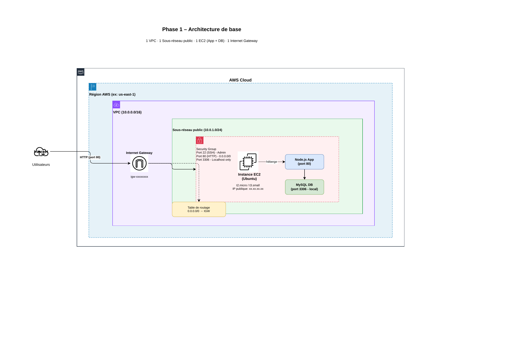

# Phase 1 - Application Web Fonctionnelle de Base

## 📋 Objectif

Créer une application web fonctionnelle qui fonctionne sur une seule machine virtuelle dans un réseau virtuel. À la fin de cette phase, vous disposerez d'un POC (Proof of Concept) démontrant l'hébergement de l'application sur le Cloud AWS.

## 🎯 Exigences Phase 1

- ✅ Créer un réseau virtuel (VPC) pour héberger l'application web
- ✅ Installer l'application web et la base de données MySQL sur une instance EC2
- ✅ Utiliser le code JavaScript fourni pour le déploiement
- ✅ Tester l'application pour s'assurer qu'elle est accessible depuis Internet
- ✅ Effectuer des tâches : affichage, ajout, suppression, modification d'enregistrements

---

## 🚀 Phase 1 - Infrastructure Monolithique

### Architecture



La Phase 1 déploie une architecture simple avec tous les composants sur une seule instance EC2 :

- **VPC** : Réseau virtuel privé (10.0.0.0/16)
- **Sous-réseau public** : 10.0.1.0/24 dans us-east-1a
- **Internet Gateway** : Pour l'accès Internet
- **Instance EC2** : t2.micro Ubuntu 22.04
  - Application Node.js + Express (port 80)
  - Base de données MySQL locale (port 3306 - localhost uniquement)
- **Security Group** : Règles de pare-feu (HTTP:80, SSH:22, MySQL:3306 local)

### Fichiers Terraform

```
phase1/
terraform.tf          # Configuration du provider AWS
variables.tf          # Variables paramétrables
network.tf           # VPC, subnet, IGW, routes
security.tf          # Groupes de sécurité
compute.tf           # Instance EC2
outputs.tf           # Outputs (URL, IP, SSH)
userdata.sh          # Script d'installation automatique
.gitignore
```

#### 📄 Détail des fichiers de configuration

**terraform.tf**
- Définit la version minimale de Terraform (>= 1.2.0)
- Configure le provider AWS (~> 5.0)
- Spécifie la région AWS via variable

**variables.tf**
- `aws_region` : Région AWS pour le déploiement (us-east-1)
- `project_name` : Nom du projet pour le tagging (student-records-app)
- `environment` : Nom de l'environnement (phase1)
- `vpc_cidr` : Bloc CIDR pour le VPC (10.0.0.0/16)
- `public_subnet_cidr` : Bloc CIDR pour le sous-réseau public (10.0.1.0/24)
- `availability_zone` : Zone de disponibilité (us-east-1a)
- `instance_type` : Type d'instance EC2 (t2.micro)
- `allowed_ssh_cidr` : Bloc CIDR autorisé pour SSH (0.0.0.0/0)

**network.tf**
- `aws_vpc.main` : VPC avec DNS activé
- `aws_internet_gateway.main` : Passerelle Internet
- `aws_subnet.public` : Sous-réseau public avec attribution automatique d'IP publique
- `aws_route_table.public` : Table de routage avec route par défaut vers IGW
- `aws_route_table_association.public` : Association subnet ↔ table de routage

**security.tf**
- `aws_security_group.web_server` : Groupe de sécurité avec règles :
  - Ingress HTTP (port 80) depuis Internet
  - Ingress SSH (port 22) depuis CIDR configuré
  - Ingress MySQL (port 3306) depuis le VPC
  - Egress : tout le trafic sortant autorisé

**compute.tf**
- `data.aws_ami.ubuntu` : Recherche de l'AMI Ubuntu 22.04 LTS la plus récente
- `aws_instance.web_server` : Instance EC2 t2.micro avec :
  - Volume root 20GB gp3
  - Script userdata pour installation automatique
  - Tags pour identification

**outputs.tf**
- `vpc_id` : ID du VPC créé
- `public_subnet_id` : ID du sous-réseau public
- `web_server_id` : ID de l'instance EC2
- `web_server_public_ip` : IP publique du serveur
- `web_server_public_dns` : DNS public du serveur
- `application_url` : URL complète de l'application
- `ssh_command` : Commande SSH pour connexion

**userdata.sh**
- Installation de Node.js, npm, MySQL
- Téléchargement du code de l'application depuis S3
- Configuration de la base de données MySQL
- Création de la table `students`
- Démarrage automatique de l'application sur le port 80

### 🎥 Démonstrations Vidéo

Les vidéos de démonstration sont disponibles sur **MyDrive** : [https://drive.google.com/drive/folders/1698wO-jPW8hJ28d3EpMSmLd9UDllHKDm?usp=sharing](https://drive.google.com/drive/folders/1698wO-jPW8hJ28d3EpMSmLd9UDllHKDm?usp=sharing)

1. **Vidéo 1 - Destroy** : Destruction de l'ancienne version de l'infrastructure
2. **Vidéo 2 - Deploy & Test** : 
   - Déploiement de l'infrastructure avec `terraform apply`
   - Démonstration de l'application fonctionnelle
   - Test d'ajout d'un nouvel étudiant
3. **Vidéo 3 - Configuration** : Présentation des fichiers de configuration Terraform

### Fonctionnalités de l'Application

-  Liste de tous les étudiants
-  Ajout d'un nouvel étudiant
-  Modification des informations d'un étudiant
-  Suppression d'un étudiant
-  Interface web Bootstrap responsive

---
