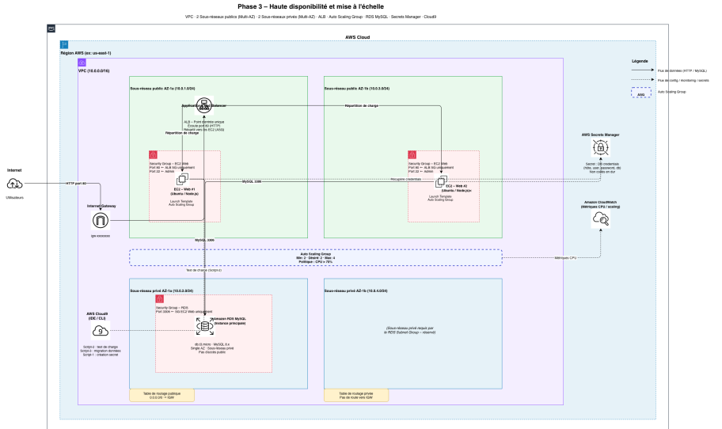

# Phase 3 - Haute Disponibilité et Scalabilité

## 📋 Objectif

Implémenter une architecture hautement disponible et scalable avec un VPC dédié, un Application Load Balancer et un Auto Scaling Group pour distribuer la charge sur plusieurs instances dans plusieurs zones de disponibilité.

## 🎯 Exigences Phase 3

- ✅ Lancer un équilibreur de charge (ALB)
- ✅ Créer un Launch Template pour les instances EC2
- ✅ Mettre en place un Auto Scaling Group multi-AZ
- ✅ Tester l'application (affichage, ajout, suppression, modification)
- ✅ Effectuer un test de charge pour vérifier le scaling automatique

---

## 🏗️ Architecture



## 📦 Composants Déployés

### VPC & Réseau
| Ressource | Valeur |
|-----------|--------|
| VPC CIDR | 10.0.0.0/16 |
| Public Subnet 1 | 10.0.1.0/24 (us-east-1a) |
| Public Subnet 2 | 10.0.4.0/24 (us-east-1b) |
| Private Subnet 1 | 10.0.2.0/24 (us-east-1a) - RDS |
| Private Subnet 2 | 10.0.3.0/24 (us-east-1b) - RDS |
| Internet Gateway | Accès Internet pour subnets publics |

### Application Load Balancer
| Paramètre | Valeur |
|-----------|--------|
| Type | Application (Layer 7) |
| Scheme | Internet-facing |
| Listener | HTTP port 80 |
| Health check path | `/` |
| Healthy threshold | 2 checks |
| Unhealthy threshold | 2 checks |
| Health check interval | 30s |
| Health check timeout | 5s |

### Auto Scaling Group
| Paramètre | Valeur |
|-----------|--------|
| Min instances | 2 |
| Max instances | 5 |
| Desired capacity | 2 |
| AZ | us-east-1a + us-east-1b |
| Health check type | ELB |
| Health check grace period | 300s |

### Launch Template
| Paramètre | Valeur |
|-----------|--------|
| AMI | Ubuntu 22.04 LTS (latest) |
| Instance type | t2.micro |
| Volume | 20 GB gp3 |
| IAM Profile | LabInstanceProfile |

### Scaling Policies (Target Tracking)
| Policy | Metric | Target |
|--------|--------|--------|
| CPU Tracking | ASGAverageCPUUtilization | 70% |
| Request Tracking | ALBRequestCountPerTarget | 1000 req/target |

### RDS MySQL
| Paramètre | Valeur |
|-----------|--------|
| Engine | MySQL 8.0 |
| Instance | db.t3.micro |
| Storage | 20 GB gp3 |
| Multi-AZ | Non (coût) |
| Backup | Désactivé (développement) |
| Public access | Non |

### Autres Composants
- **AWS Secrets Manager** : `student-records-app-db-credentials-phase3`
- **AWS Cloud9** : Environnement t3.small pour administration (auto-stop 30 min)

## 🔧 Choix Techniques

### VPC dédié vs VPC par défaut
Phase 3 crée un **VPC dédié** pour une isolation réseau complète :
- Contrôle total du plan d'adressage
- Séparation publique/privée des ressources
- Préparation pour une architecture de production

### Dual Scaling Policies
Deux politiques de scaling complémentaires :
1. **CPU-based** : Réagit à la charge CPU des instances
2. **Request Count-based** : Réagit directement au volume de requêtes HTTP

### EC2 dans subnets publics
Les instances EC2 sont dans les subnets publics pour simplifier le déploiement (pas de NAT Gateway nécessaire), tout en étant protégées par Security Groups.

### RDS dans subnets privés
La base de données est entièrement isolée dans des subnets privés sans accès Internet.

## 📊 Fichiers Terraform

```
phase3/
 terraform.tf       # Provider AWS + version
 variables.tf       # Variables (CIDR, types, etc.)
 network.tf         # VPC, subnets, IGW, route tables
 security.tf        # Security Groups (ALB, web, RDS)
 loadbalancer.tf    # ALB, Target Group, Listener
 launch-template.tf # Template EC2 pour ASG
 autoscaling.tf     # ASG + scaling policies
 database.tf        # RDS MySQL + subnet group
 secrets.tf         # Secrets Manager
 app-secret.tf      # Secret pour l'application
 cloud9.tf          # Environnement Cloud9
 data.tf            # Data sources (AMI, IAM)
 outputs.tf         # Outputs (ALB URL, RDS endpoint...)
 userdata.sh        # Bootstrap EC2 instances
```

## 
```bash
# 1. Aller dans le dossier phase3
cd phase3

# 2. Initialiser Terraform
terraform init

# 3. Vérifier le plan
terraform plan

# 4. Appliquer
terraform apply -auto-approve

# 5. Récupérer l'URL de l'application
terraform output application_url
```

### Temps de déploiement estimé
- VPC + réseau : ~30 secondes
- Security Groups : ~10 secondes
- ALB + Target Group : ~30 secondes
- RDS MySQL : ~8-10 minutes
- EC2 instances (via ASG) : ~3 minutes
- **Total : ~12-15 minutes**

## ✅ Tests Effectués

### Test fonctionnel
```bash
# Page d'accueil
curl http://<ALB-DNS-NAME>/

# Liste des étudiants
curl http://<ALB-DNS-NAME>/students

# Ajout, modification, suppression via l'interface web
```

### Test de charge (loadtest)
```bash
npm install -g loadtest

# Test avec 100 utilisateurs simultanés pendant 60 secondes
loadtest -c 100 -t 60 http://<ALB-DNS-NAME>/students

# Résultats observés :
# - CPU monte au-dessus de 70%
# - ASG déclenche scale-out automatiquement
# - Nouvelles instances intégrées dans ~3 minutes
# - CPU redescend, scale-in après cooldown
```

## 🚧 Difficultés Rencontrées

1. **Timing EC2 vs RDS**
   - **Problème** : Les instances EC2 démarraient avant que RDS soit disponible
   - **Solution** : `depends_on = [aws_db_instance.main, aws_secretsmanager_secret_version...]` dans l'ASG

2. **Health checks échouaient au démarrage**
   - **Problème** : L'application Node.js prenait du temps à démarrer
   - **Solution** : Grace period de 300s + seuil de 2 checks seulement

3. **Subnets publics pour ASG**
   - **Observation** : Pas de NAT Gateway (coût), donc EC2 dans subnets publics
   - **Implication** : Les instances ont des IPs publiques mais sont protégées par SG

4. **CIDR overlap**
   - **Problème** : Chevauchement initial entre subnets publics et privés
   - **Solution** : Plan CIDR précis (public: .1.x, .4.x / privé: .2.x, .3.x)

## 📈 Métriques

| Métrique | Valeur |
|----------|--------|
| Latence moyenne (2 instances) | ~100ms |
| Throughput max (2 instances) | ~150 req/s |
| Temps scale-out | ~3 minutes |
| Min instances | 2 (haute disponibilité) |
| Max instances | 5 |

### Coûts estimés (us-east-1)
| Ressource | Coût/mois |
|-----------|-----------|
| ALB | ~$16 |
| EC2 2x t2.micro | ~$17 |
| RDS db.t3.micro | ~$12 |
| Data Transfer | ~$2 |
| Secrets Manager | ~$0.40 |
| Cloud9 (30min/j) | ~$1 |
| **Total** | **~$48/mois** |

## 🔒 Sécurité

### Security Groups en cascade
```
Internet → ALB-SG (port 80)
            ↓
         Web-SG (port 80 depuis ALB-SG uniquement)
            ↓
         RDS-SG (port 3306 depuis Web-SG uniquement)
```

### Isolation RDS
- Subnets privés, pas d'IP publique
- Accessible uniquement depuis les instances EC2
- Chiffrement possible au repos

### Secrets Manager
- Secret `student-records-app-db-credentials-phase3`
- JSON avec `username`, `password`, `host`, `dbname`
- Récupéré dynamiquement au démarrage des instances

## 🧹 Nettoyage

```bash
terraform destroy -auto-approve
```

 Prochaines Étapes (Phase 4)## 

- Conteneurisation de l'application avec Docker
- Stockage de l'image sur Amazon ECR
- Déploiement du container sur EC2

## 🎥 Vidéos de démonstration

Les vidéos de déploiement et de test sont disponibles sur **MyDrive** :
[https://drive.google.com/drive/folders/1698wO-jPW8hJ28d3EpMSmLd9UDllHKDm?usp=sharing](https://drive.google.com/drive/folders/1698wO-jPW8hJ28d3EpMSmLd9UDllHKDm?usp=sharing)

## 🔗 Références

- [network.tf](network.tf) - VPC et subnets
- [loadbalancer.tf](loadbalancer.tf) - ALB configuration
- [autoscaling.tf](autoscaling.tf) - ASG et scaling policies
- [launch-template.tf](launch-template.tf) - Template EC2
- [database.tf](database.tf) - RDS MySQL
- [security.tf](security.tf) - Security Groups
- [userdata.sh](userdata.sh) - Bootstrap script
