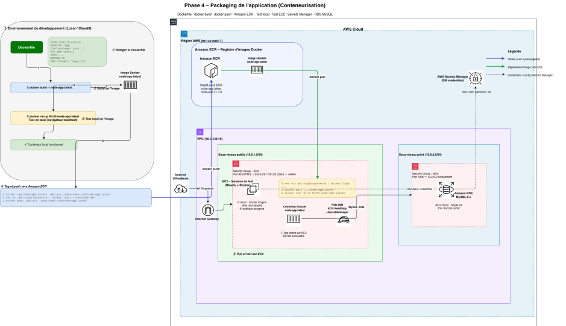

# Phase 4 - Packaging de l'Application

## Objectif

Préparer l'application pour être facilement déployable en la conteneurisant avec Docker.

## Exigences Phase 4

- Créer un **Dockerfile** pour conteneuriser l'application
- Stocker l'image sur **Amazon Elastic Container Registry (ECR)** ou une autre registry
- Tester l'exécution du package localement
- Tester le déploiement sur une instance EC2

---

## Objectif Original

Conteneuriser l'application de gestion des étudiants avec Docker et stocker l'image sur Amazon ECR.

## Résultat

**Application déployée et fonctionnelle** : http://3.81.207.57
- Image Docker optimisée : 134MB (Node.js 18-alpine)
- Container stocké dans ECR : `561885755604.dkr.ecr.us-east-1.amazonaws.com/student-records-app:latest`
- Base de données initialisée automatiquement avec 3 étudiants
- Infrastructure entièrement automatisée (destroy + apply = tout fonctionne)

## Architecture Phase 4



## Livrables Phase 4

### 1. Dockerfile (Multi-stage Build)
 **Stage 1 (base)** : Node.js 18-alpine avec workdir setup  
 **Stage 2 (dependencies)** : Installation des dépendances (npm ci)  
 **Stage 3 (release)** : Image finale optimisée
- Utilisateur non-root (nodejs:1001)
- Health check intégré (interval 30s)
- Variables d'environnement configurables
- Taille finale : **134MB** (vs ~500MB image Node standard)

### 2. Infrastructure Terraform
 **ECR Repository** avec scan d'images et lifecycle policy  
 **RDS MySQL 8.0** (db.t3.micro) avec stockage chiffré  
 **EC2 Instance** (t3.small) avec Docker pré-installé  
 **Security Groups** pour EC2 (HTTP/SSH) et RDS (MySQL)  
 **Secrets Manager** pour les credentials de la base  
 **IAM Role** (LabRole) avec permissions ECR et Secrets Manager  
 **Userdata automatisé** : installation Docker, init DB, démarrage container

### 3. Automatisation Complète
 **Initialisation DB automatique** via userdata  
 **Pull image depuis ECR** automatique au démarrage  
 **Health checks** pour vérifier l'état du container  
 **Infrastructure as Code** : destroy + apply = tout fonctionne

## Déploiement

### 1. Build et push de l'image vers ECR

```bash
cd phase4

# Build l'image Docker
docker build -t student-records-app:latest .

# Authentification à ECR
aws ecr get-login-password --region us-east-1 | \
  docker login --username AWS --password-stdin 561885755604.dkr.ecr.us-east-1.amazonaws.com

# Tag et push vers ECR
docker tag student-records-app:latest 561885755604.dkr.ecr.us-east-1.amazonaws.com/student-records-app:latest
docker push 561885755604.dkr.ecr.us-east-1.amazonaws.com/student-records-app:latest
```

### 2. Déployer l'infrastructure avec Terraform

```bash
cd terraform

# Initialiser Terraform
terraform init

# Créer toute l'infrastructure (ECR, RDS, EC2, Secrets, etc.)
terraform apply -auto-approve

# L'instance EC2 va automatiquement:
# 1. Installer Docker
# 2. Installer MySQL client
# 3. Récupérer les credentials depuis Secrets Manager
# 4. Initialiser la base de données avec le schéma et les données
# 5. Pull l'image depuis ECR
# 6. Démarrer le container
```

### 3. Tester l'application

```bash
# Récupérer l'URL de l'application
terraform output application_url

# Tester la page d'accueil
curl http://3.81.207.57

# Tester la liste des étudiants
curl http://3.81.207.57/students
```

### 4. Test local avec docker-compose (optionnel)

```bash
# Lancer l'application localement avec MySQL
docker-compose up -d

# Tester
curl http://localhost:80/students

# Arrêter
docker-compose down -v
```

## Vérifications et Tests

| Test | Status | Résultat |
|------|--------|----------|
| Build image Docker |  | 134MB (optimisé avec Alpine) |
| Test local docker-compose |  | Application démarre et se connecte à MySQL |
| Push vers ECR |  | Image disponible dans le registry |
| Infrastructure Terraform |  | 13 ressources créées |
| Initialisation DB automatique |  | Table `students` créée avec 3 enregistrements |
| Container running sur EC2 |  | Health check OK |
| Application accessible |  | http://3.81.207.57 |
| Liste étudiants affichée |  | Alice, Bob, Charlie visibles |
| Destroy + Apply |  | Infrastructure entièrement automatisée |

## Ressources Créées

```
13 resources created:
 ECR Repository (student-records-app)
 ECR Lifecycle Policy
 RDS MySQL Instance (db.t3.micro)
 RDS Subnet Group
 DB Secret (Secrets Manager)
 DB Secret Version
 Security Group - EC2
 Security Group - RDS
 EC2 Instance (t3.small)
 Data Source - VPC
 Data Source - Subnets
 Data Source - AMI
 Data Source - LabInstanceProfile
```

## Sécurité

- Container avec utilisateur non-root (nodejs:1001)
- RDS avec stockage chiffré (gp3)
- Credentials stockés dans Secrets Manager
- Security Groups restrictifs (EC2 ↔ RDS uniquement)
- ECR scan d'images activé
- Health checks pour détection de pannes

## Optimisations

- **Image Docker** : Multi-stage build → 134MB (vs 500MB+)
- **Cache layers** : npm dependencies séparées
- **Base Alpine** : Image Linux légère
- **Lifecycle ECR** : Garde seulement les 10 dernières images
- **Userdata** : Installation et configuration automatiques
- **Health checks** : Redémarrage automatique si échec

## Infrastructure as Code

Le projet respecte le principe IaC :
```bash
# Destroy complet
terraform destroy -auto-approve

# Recréer TOUT (inclus init DB)
terraform apply -auto-approve

# Résultat: Application fonctionnelle en ~3 minutes
```

## Learnings Phase 4

1. **Multi-stage builds** réduisent drastiquement la taille des images
2. **aws-sdk** doit être ajouté aux dépendances (non présent dans package.json initial)
3. **Amazon Linux 2023** n'a pas `nc` (netcat) installé par défaut
4. **Userdata** peut installer des packages et initialiser des bases de données
5. **Secrets Manager** permet une gestion centralisée des credentials
6. **Health checks Docker** assurent la haute disponibilité
7. **ECR lifecycle policies** évitent l'accumulation d'images anciennes

## ⏭ Prochaines Étapes

Phase 5 : Pipeline CI/CD avec automatisation build/test/deploy

## Points clés

- Image optimisée (multi-stage build si possible)
- Gestion des secrets via variables d'environnement
- Health check dans le Dockerfile
- Tag de version

## Vidéos de démonstration

Les vidéos de déploiement et de test sont disponibles sur **MyDrive** :
[https://drive.google.com/drive/folders/1698wO-jPW8hJ28d3EpMSmLd9UDllHKDm?usp=sharing](https://drive.google.com/drive/folders/1698wO-jPW8hJ28d3EpMSmLd9UDllHKDm?usp=sharing)

